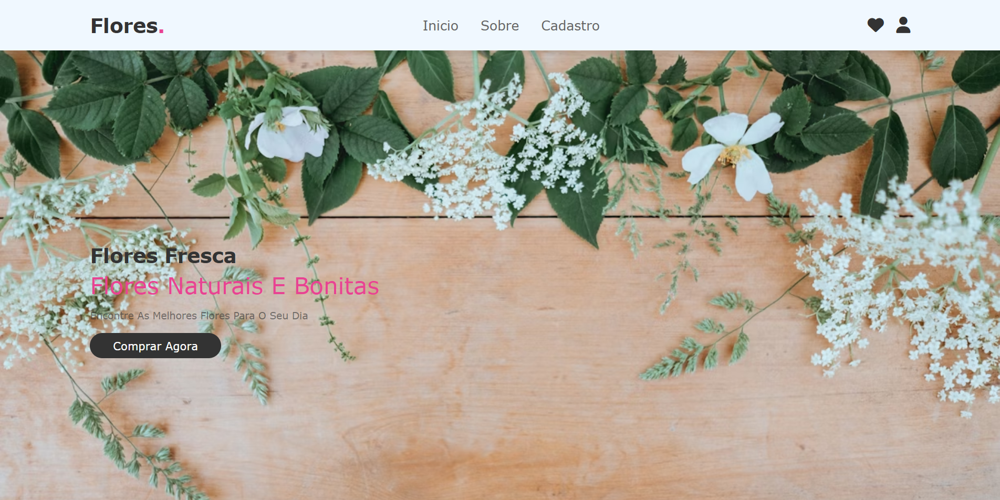
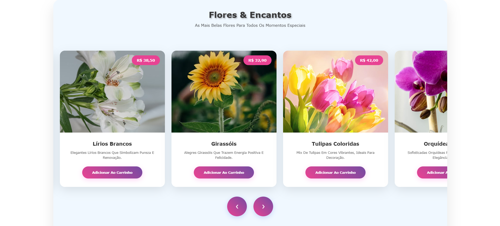
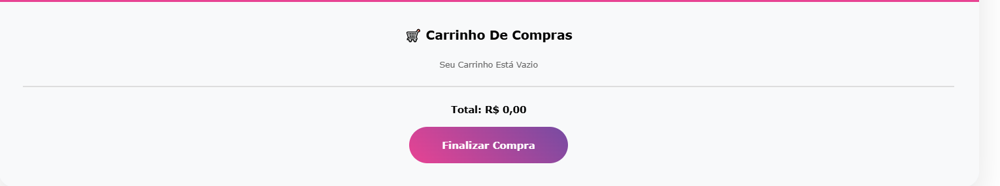
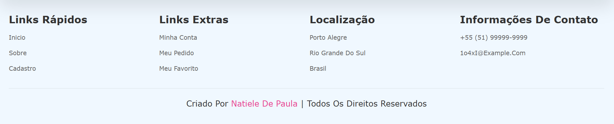
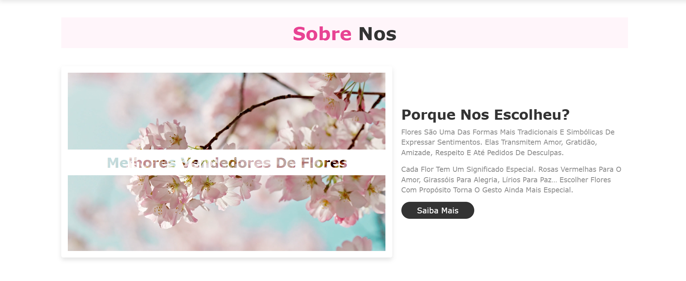
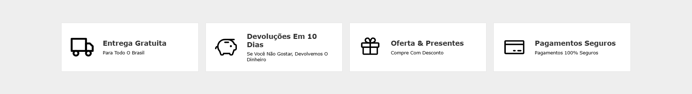
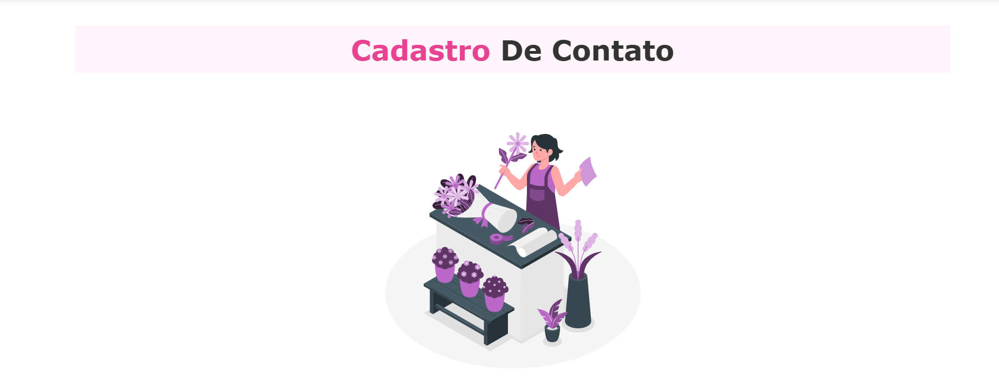
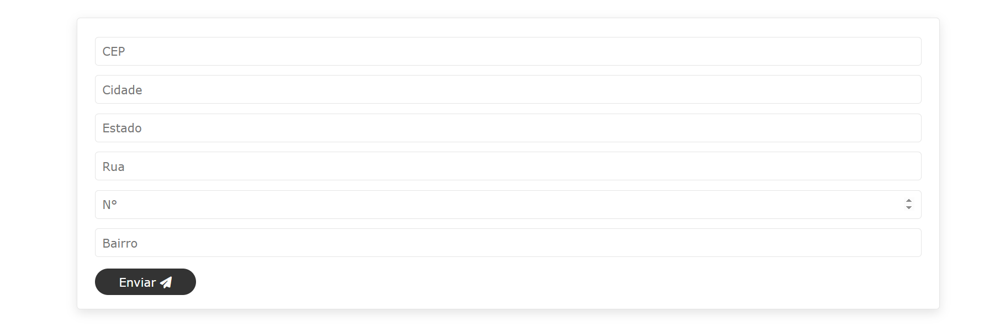

# 🌸 Projeto Flor-API

**Flor-API** é um projeto web desenvolvido com **HTML**, **CSS** e **JavaScript**. Conta com uma interface simples, limpa, responsiva e funcional, além de uma tela de cadastro com campos básicos de formulário. Ideal para treinar **consumo de APIs** e **formulários em JavaScript**.

---

## 🧾 Tela de Cadastro

O projeto conta com uma **tela de cadastro básica**, onde o usuário pode inserir:

- CEP
- BAIRRO
- RUA

Embora o formulário ainda não envie os dados para um back-end, ele pode ser facilmente adaptado para fazer isso. Atualmente, a tela serve para:

- Treinar **validação de campos com JavaScript**
- Praticar **design de formulários responsivos**
- Simular uma experiência real de cadastro

---

## 🧩 Funcionalidades

- **Formulário de cadastro** com campos validados
- Layout **100% responsivo**
- Estilização com **cores suaves** e animações sutis

---

## 📸 Imagem de Prévia










---

## 📸 Prévia do Projeto

(https://natieledpaula.github.io/Flor-Api/)

---

## 📁 Estrutura do Projeto

```
Flor-Api/
├── index.html # Página principal 
├── cadastro.html # Tela de cadastro simples
├── sobre.html # Descrição do site
├── src/
| ├── css # Estilização do site
│ ├── img # Imagem das flores e dos icones
| └── js/
|      ├── cadastro.js # Tela de cadastro com Api de CEP
|      └── carrossel.js # Funcionalidade do crrossel das flores e do carrinho de compras
└── README.md # Documentação do projeto
```

---

## 🎨 Paleta de Cores

| Elemento               | Descrição                  | HEX       | Amostra |
|------------------------|----------------------------|-----------|---------|
| Fundo da Página        | Branco Rosado              | `#FFF0F5` |  |
| Texto Principal        | Cinza Escuro               | `#2D2D2D` |  |
| Botão Principal        | Rosa Flor                  | `#E91E63` |  |
| Borda de Campos        | Rosa Claro                 | `#F8BBD0` |  |
| Hover do Botão         | Rosa Escuro                | `#AD1457` |  |

---

## 🛠️ Tecnologias Utilizadas

### 🖥️ Frontend


---

## 📜 Licença

Este projeto está sob a **Licença MIT**.  
Sinta-se livre para usar, adaptar e compartilhar, com os devidos créditos.

---

## 👩‍💻 Autora

Desenvolvido por **[Natiele de Paula](https://github.com/natieledpaula)** 🌸  
Projeto criado com foco em aprendizado de front-end e consumo de APIs.

---

Feito com carinho, código e flores. 🌼✨
